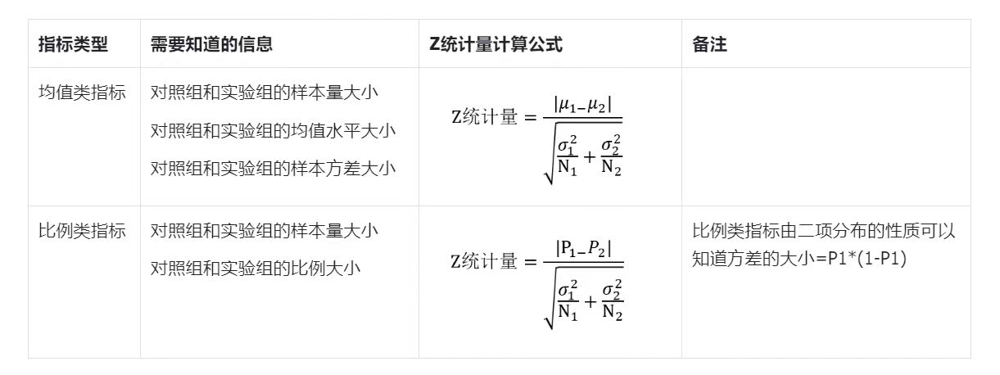
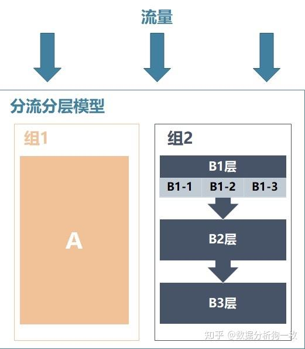

# 

# ab测试

## 1. 假设检验

### 1. 理论知识

- 什么是假设检验
  - 假设+检验，先对要估计的值提出一个假设，然后利用样本信息去检验这个假设是否成立
    - 假设
      - 原假设（零假设）
        - H0：μ = μ0（提出假设之后，我们需要判断原假设正确、原假设错误，但是由于我们是用样本去判断总体的，所以会出现判断错误的情况）
          - a错误：原假设为真，我们拒绝了。真实的情况是连个样本的均值是不显著的，我们选择了H1，认为他们显著。在真实的企业中，我们把没有收益的决策当成有收益了，对企业资源造成了浪费。在做ab测试中更关注第一类错误。
          - β错误：原假设为伪，我们没有拒绝
      - 备择假设
        - H1：μ != μ0
    - 检验
      - 确定检验统计量
        - Z（总体均值、样本均值、总体比例、样本比例）
          - 大样本
          - 小样本、正态分布、总体标准差已知
        - t
          - 小样本、总体标准差未知
        - 卡方
          - 不能用中心极限定理，把某个样本服从某个分布，这个时候可以考虑使用卡方检验，检验分类变量之间是否显著
          - 拟合优度检验
            - 依据总体的分布状况，计算出分类变量中各类别的期望频数，与分布的观察频数进行对比，判断观察频数与期望频数是否存在显著差异
          - 独立性检验
            - 两个分类变量是否独立
        - 确定显著性水平和拒绝域
          - 显著性水平：概率值，样本结果的不可信程度。小概率事件，一般用小于等于0.05作为标准。
          - 拒绝域：
            - 双尾检验：
            - 单尾
        - p_value
          - p是一个概率：原假设出现的概率，如果概率较小（a/2双尾），这种情况也发生了，根据小概率事件原理，我们就有理由拒绝原假设，p值越小，拒绝的越充分。
          - 为什么用p：
            - 当使用z，t时，确定a之后，决策区间也就确定下来了。优点就是决策边界清晰，缺点是：当检验统计量落入拒绝域之后，无论z是多大，弃真错误的概率就是a，不能精确的表达决策的风险。
            - p值是一个概率，观察的是实际数据和样本数据之间不一致的概率值。是一个具体的值。
      - 做出结论
        - 拒绝还是接受原假设
      - 假设检验的功效（Power）受到以下三个因素的影响：
        1. 样本量：其他条件保持不变时，样本量越大，功效越大。
        2. 显著性水平（α）：其他条件保持不变，显著性水平越小，功效越小。
        3. 两总体之间的差异（difference）：其他条件不变，两个总体参数之间的差异越大，功效就越大。特别要注意的是这个差异是总体均值的差异，而非样本均值的差异。

### 2. 案例

我们在做ab实验的时候，检验的对象是我们关心的指标，但是不同类型的统计指标，检验统计量的计算方式是不一样的。

- 统计指标
  - 均值类：人均投稿数、人均使用时长、人均GMV
  - 概率类指标：次日留存，付费率、投稿率
  - 分位数指标：用户使用时长的中位数
  - 比率指标：点击率、消耗率

在统计学中和业务中，通常关注均值类和概率类指标

1. 提出假设
   1. 使用双尾检验
      1. 防止主观想法干扰数据发挥作用。双尾检验不需要我们明确谁大谁小的检验
      2. 同时照顾到正向的结果和负向的结果，更接近多变的现实情况。
   
2. 检验
   1. 检验统计量的选择
      1. 实际业务场景中，我们拿到的数据都是比较大的（>30），所以根据中心极限定理，样本数据的分布近似于正态分布
   
         中心极限定理：在大样本情况下，不论之前的样本是服从什么分布的，均值变量是趋近于正态分布的
   
   2. 检验统计量计算
   
      1. 

​			Z分数相当于正态分布标准化的过程			

​			p值计算：=(1-NORMSDIST(G33))*2 g33表示z值

## abtest流程

1. 目标设定：

   - 确定想通过ab测试提高的具体目标，例如：提高网站的转化率，按钮的点击率。通过什么样的改变会提高这些转化率
   - 目标1：判断哪个更好----把旧的东西换成新的东西，哪个更好
     - 更换ui界面，更换登录按钮
   - 目标2：计算收益 ---- 增加一个新的功能、活动。会给平台带来哪些收益
2. 假设制定：

   - 根据你做这个实验的目的，来选择合适的指标评估。既要考虑想要提高的指标，也要考虑会对其他业务造成影响。
3. 选择变量：

   - 变量是需要验证的部分，我选择的是哪些颜色的按钮会提高按钮的点击率，所以灰色、绿色是变量
4. 实验设计

   - 样本量大小的选择
     - 为什么要选择样本量 
       - 流量有限：有大量用户的公司还好，可以选择的样本量比较大。如果是小公司，他们的流量是有限的，需要合理的使用这些资源
       - 试错成本：如果选择平台的大量用户，如果这个结果朝向不好的一面走，对于公司来说亏损太大。
     - 怎么选
       - 不同类型的统计指标有不同的计算方法
         - 均值和比例类指标[Sample Size Calculator (Evan’s Awesome A/B Tools) (evanmiller.org)](https://www.evanmiller.org/ab-testing/sample-size.html)
         - 计算分类变量  卡方检验[Chi-Squared Test (Evan’s Awesome A/B Tools) (evanmiller.org)](https://www.evanmiller.org/ab-testing/chi-squared.html)
       - 影响因素
         - 需要4个参数：a，β，目标的历史值，预计提升的百分比
         - a是弃真错误，如果a太大，弃真的概率也越大，检测不出来差异
         - β是取伪错误，如果β太大，取伪的概率也越大，正确的和错误的混在了一起，那么结果都接近一样
         - 目标的历史值，做对照
         - 预计提升的百分比：这个可以和业务方沟通，认为这个提高百分比是多少才是有意义的，值得做的
   - 测试的持续时间
     - 为什么计算它的持续时间
       - 减少偶然性
       - 考虑用户行为：用户在接触新的东西的时候，存在好奇心，所以比较新奇，接触一段时间后看有没有变化
       - 周期性的因素
       - 避免样本误差
     - 怎么计算
       - 计算出来所需要的最小样本量之后
       - 持续时间（天） = (样本量 * 2) / (每天的访问者数 * 参与测试的访问者比例)
       - 这个时间需要根据季节性因素、节假日因素算在一起
     - 注意：
       - 满足最小样本量之后我们还不能停止试验，因为存在新奇效应。我们需要扩大时间来观察，直到实验组的指标趋于稳定
   - 分流
     - 为什么要进行分流
       - 确保随机性：通过随机分配到不同的实验版本，可以确保每个组的用户特征都是相似的
       - 控制变量：除去实验的变量，排除其他变量对结果的影响
       - 避免出现辛普森谬论
     - 怎么分流
       - 根据实验的目的：
         - 不影响用户体验类：均匀分流，快速得出实验结论
         - 不确定性较强：小流量分配
         - 希望收益最大化实验：做某种活动获得某种收益，这个活动正常来说肯定比没做活动更好。所以直接给实验组分配较大的流量，对照组分配小部分的流量。
       - 分流（互斥）
         - 用户分流是把用户按照性别、地域、年龄等用户均匀的分为几个组，1个用户只能出现在一个组里。这就导致了只能并行的进行几个实验，效果比较慢。
       - 分层（正交）
         - 同一份流量可以出现在多个实验层，也就是说同一个用户可以在多个实验层，前提是这些实验在业务逻辑上是独立的
       - 分流分层模型（既存在分流也存在分层）
         - 
   - 分流之后进行aa实验，保证实验前分组是随机分配，没有显著差异的
   - 选择检验统计量，确定显著性水平和拒绝域。计算检验统计量和p值，做出决策判断

## ab面试题

1.  什么是一类错误？什么是二类错误。
   - 一类错误：原假设为真，我们计算出来的结果是拒绝原假设，选择了备择假设。弃真错误
   - 二类错误：原假设是错误的，我们计算出来的结果是接受原假设。取伪错误。
   - 一类错误在企业中更难以接受，例如一个app功能变动，实际上不能带来收益，但是我们计算结果是可以给我们带来收益。第二类错误是实际可以带来收益，但是我们计算出来的误差，表示不能带来收益。一个不好的功能上线会给用户带来不好的影响，这个影响可能导致DAU，留存率下降。
2. 什么是中心极限定理
   - 中心极限定理就是我们从总体数据中抽取足够多的独立样本数据，样本的均值会收敛于正态分布
3. 如果假设不显著怎么办？
   - 延长实验周期，观察一下
4. 如果ab测试的结果在统计学上是显著的，但是在实际业务中是不显著的。为什么？
   - 这个可能的原因是ab测试中选取的样本数量和总体数量差异不大，这样即使有小的改变，统计结果也是显著的，但是在实际的业务场景中就不显著了。
5. 如果在ab实验中选取的指标在统计上来说是不显著的，如何判断这个实验的收益？
   - 按时间为单位拆开，查看每天的变化情况，如果每一天的实验组指标都大于对照组。我们可以认为在一个观测周期内，实验组的关键指标大于对照组的。我们就得出这个优化可以上线的结论
6. 实验组优于对照组就能上线？
   - 不一定
   - 新奇效应，刚开始几天实验组优于对照组，稳定下来之后对照组可能优于实验组
   - 需要考虑对其他业务的影响。成本和收益的综合评估。不能看收益好就上线。
7. ab测试一定要做吗？
   - 不一定
   - 我们需要综合评估成本和可能得到收益。如果是一个非常小的改动，带来的收益明显小于实验成本，那么我们可以设置一些可选项的开关，让用户自己选择用哪一个，基于这些开关的使用情况，做调整；另一种是做问卷调研，收集用户的意见。

